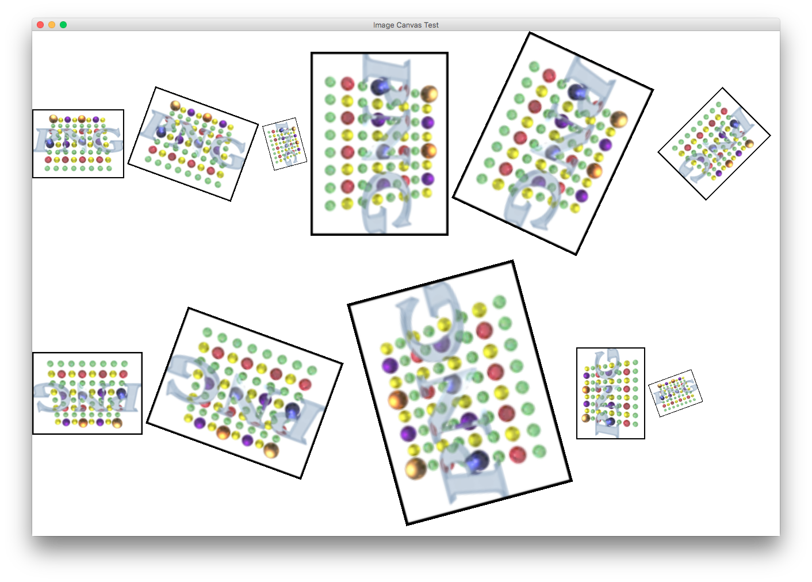

# JfxImageCanvas
JfxImageCanvas is a JavaFX Class that can be used to render a scaled and rotated image in a canvas.

The image can be rotated by multiples of 90 degree and can be sized by a scale factor. The canvas size will be set according to these transformations.

	public ImageCanvas(Image image, double angleDegree, double scaleFactor)

Examples

- ImageCanvas canvas = new ImageCanvas(image, 65.0, 2.5) - creates an image canvas from an an image rotated by 65 degrees and scaled by 2.5

Based on ideas from: https://stackoverflow.com/questions/18260421/how-to-draw-image-rotated-on-javafx-canvas
