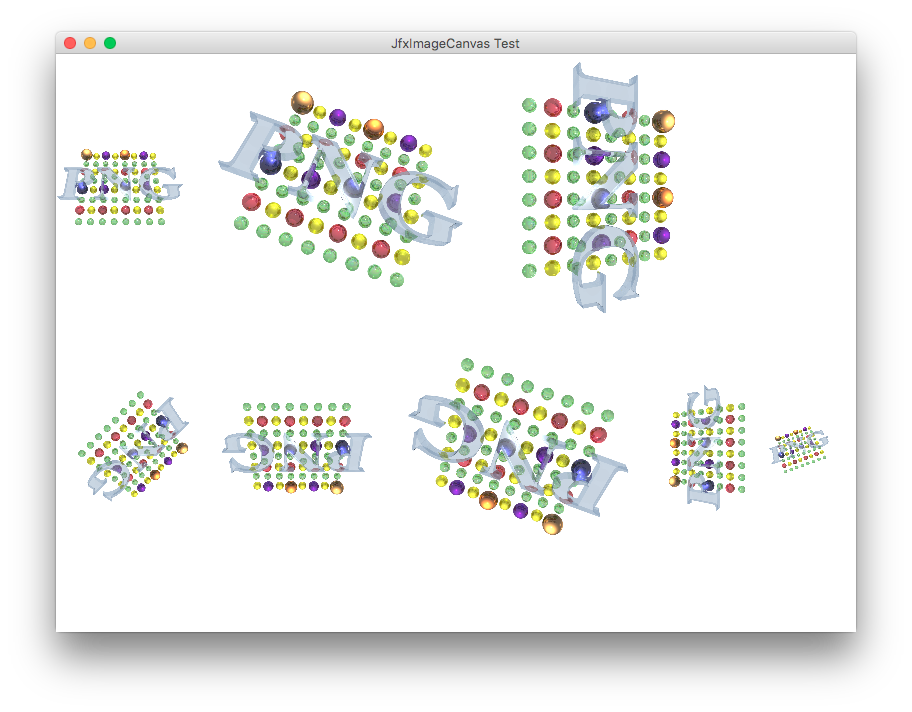

# JfxImageCanvas
JfxImageCanvas is a JavaFX Class that can be used to render an image in a canvas.

The image can be rotated and resized by a scale factor. The canvas size will be set according to these transformations. This is illustrated in the picture below. Width and height of the canvas are calculated after resizing and rotating the image so that it fits exactly into the boundaries of the canvas (blue):


The JfxImageCanvas is created using an JavaFX image object (see [here](https://docs.oracle.com/javase/8/javafx/api/javafx/scene/image/Image.html)) together with an rotation angle in degrees and a scale factor.

The class is derived from JavaFX canvas (see [here](https://docs.oracle.com/javase/8/javafx/api/javafx/scene/canvas/Canvas.html)). Instances can be added to standard JavaFX containers like AnchorPane, GridPane, FlowPane, Hbox, VBox etc.

```java
public class ImageCanvas extends Canvas
```

The JfxImageCanvas calculates width and height according to image width and height, rotation angle and scale factor. This allows the container's layout process based on these boundaries.

Examples
The following example shows the usage of the class. In the example several objects are created from the same image with different rotations and scale factors:
```java
/**
 * Do some tests with JfxImageCanvas.
 */
public class JfxImageCanvasTest extends Application {
	@Override
	public void start(Stage stage) {
		stage.setTitle("JfxImageCanvas Test");
		Image image = new Image("https://upload.wikimedia.org/wikipedia/de/b/bb/Png-logo.png");
		FlowPane root = new FlowPane(5.0, 5.0);
		// display several instances
		ImageCanvas[] canvases = new ImageCanvas[] {
				new ImageCanvas(image, 0.0, 0.1),
				new ImageCanvas(image, 20.0, 0.2),
				new ImageCanvas(image, 90.0, 0.2),
				new ImageCanvas(image, 135.0, 0.1),
				new ImageCanvas(image, 180.0, 0.12),
				new ImageCanvas(image, 200.0, 0.18),
				new ImageCanvas(image, 270.0, 0.1),
				new ImageCanvas(image, 340.0, 0.05),
		};
		for (ImageCanvas imageCanvas : canvases) {
			root.getChildren().addAll(imageCanvas);
		}
		StackPane frame = new StackPane();
		frame.getChildren().add(root);
		stage.setScene(new Scene(frame));
		stage.centerOnScreen();
		stage.setWidth(800.0);
		stage.setHeight(600.0);
		stage.show();
	}

	public static void main(String[] args) {
		launch(args);
	}
}
```

The resulting application window is show below:



I am not sure whether there is a better way to create a rotated and scaled image view or whether the JavaFX library already provides a solution.

The JavaFX class ImageView did not work for my use case and I found some ideas here that I adapted for my implementation:

https://stackoverflow.com/questions/18260421/how-to-draw-image-rotated-on-javafx-canvas
